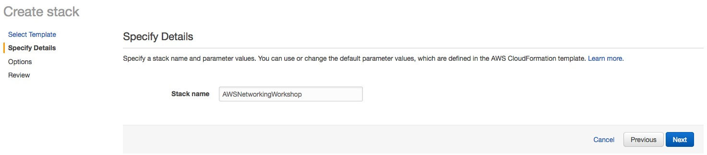

**AWS Networking Workshop**
--------------------

More and more customers have been migrating their production workloads from on-premises into AWS cloud. But in the mean time, it's a huge challenge on how to connect tens or hundreds of VPC together and still have ability to control routing. Otherwise, how to build a hybrid DNS architecture to allow all workloads communicating each other through DNS is a complicated question as well.

The objective of this workshop is to take you to build a hybrid architecture step by step by using three new AWS networking services AWS Transit Gateway, AWS Client VPN and Route53 Resolver. In the workshop, we will create 3 VPCs, 2 of them are spoke VPC and the other is shared service VPC where we will create AWS managed Microsoft Directory, AWS Client VPN endpoints and DNS service.The diagram below is the high level architecture we will build in this workshop.    

**STEP 1 - Enviornment Set-up**
---------------------------

For avoiding misconfiguration, we will automatically create the 3 VPCs by using CloudFormation. Copy the link below and specify the path as an template URL. 

<https://s3.amazonaws.com/ykwang-networking-workshop/networking-workshop.yaml>

1) Choose **Creat new stack** on the CloudFormation page.
 

2) Past the link under **Specify an Amazon S3 template URL** and click **Next**.

3) Specify your stack name and choose **KeyName** for accessing EC2 via SSH, then click **Next**.

4) Click **Next** to skip **Option** page and click **Create** on **Review** page. CloudFormation will automatically create the VPCs and related resources. Wait about 25 ~ 30 minutes and make sure the status is **CREATE_COMPLETE**.

5) Verify all resources CloudFormation created are identical as below.  

**VPC AND SUBNET**

* VPC4VPN - 10.1.0.0/16 (VPC4VPN-SN1 - 10.1.1.0/24, VPC4VPN-SN2 - 10.1.2.0/24)
* VPC10 - 10.10.0.0/16 (VPC10-SN1 - 10.10.1.0/24, VPC10-SN2 - 10.10.2.0/24)
* VPC20 - 10.20.0.0/16 (VPC20-SN1 - 10.20.1.0/24, VPC20-SN2 - 10.20.2.0/24)

**EC2 INSTANCE (Record your EC2 private IP)**

* ICMP Client in VPC10 - IP 10.10.1.X
* ICMP Client in VPC20 - IP 10.10.2.X

**Directory Service (Record MicrosoftAD DNS address)**

**STEP 2 - Create VPN Users on Microsoft AD**
---------------------------
To create users and groups in an AWS Directory Service directory, you must be connected to a EC2 instance that has been joined to your AWS Directory Service directory, and be logged in as a user that has privileges to create users and groups. You will also need to install the Active Directory Tools on your EC2 instance so you can add your users and groups with the Active Directory Users and Computers snap-in. 

1) Create a DHCP Options Set for Your Directory

Open the Amazon VPC console and choose **DHCP Options Sets** in the navigation pane. Then choose Create DHCP options set. Type a name you like and type **workshop.aws.com** for **Domain name**. For **Domain name servers**, type the IP addresses of your AWS provided directory's DNS servers you just recorded. Leave the settings blank for **NTP servers**, **NetBIOS name servers**, and **NetBIOS node type**. Choose **Create DHCP options set**. Make a note of the ID of the new set of DHCP options (dopt-xxxxxxxx).

2) Apply DHCP Options Set to VPC4VPN

Back to VPC console, select **VPC4VPN**, choose **Actions**, and then choose **Edit DHCP Options Set**. 

In the Edit DHCP Options Set dialog box, select the options set that you recorded in last step. Then choose Save. 

3) Create a Windows Instance and Automatically Join the Directory

Open the Amazon EC2 console, choose Launch Instance and select **Microsoft Windows Server 2016 Base AMI**. On the page of **Configure Instance Details**, do the following:

* Choose **VPC4VPN** for **Network**
* Choose **VPC4VPN-SN1** for **Subnet**
* Choose **Use subnet setting(Enable)** for **Auto-assign Public IP**
* Choose **workshop.aws.com** for **Domain join directory**

Click **Create new IAM role** to create a new IAM role and attach the AmazonEC2RoleforSSM policy. Under **Select your use case**, choose **EC2**, and then choose **Next**. Type **AmazonEC2RoleforSSM** at search bar, select it and then choose **Next**.

For **Role name**, enter a name for your new role (such as EC2DomainJoin). Then choose Create role.

Back to the page of **Configure Instance Details**, select **EC2DomainJoin** for **IAM role**.

Keep the setting default on the page of **Add Storage**, add key:Name and value:WinServer for tag, choose **Select an existing security group** and select the security group with name **Allow RDP and ICMP** and then click **Review and Launch**. Click **Launch** again and select a keypair for this workshop. 

4) Install the Active Directory Tools on Your EC2 Instance

Open EC2 console, download Remote Desktop File and get the administrator password.

Open your RDP software and login Windows instance with username:Administrator and password you just decrypted and then do the following:

From the Start menu, choose Windows PowerShell and Copy the following command.

		Install-WindowsFeature -Name GPMC,RSAT-AD-PowerShell,RSAT-AD-AdminCenter,RSAT-ADDS-Tools,RSAT-DNS-Server

**IMPORTANT** After installation of AD tools, logout and re-login with domain administrator. Use **workshop.aws.com\admin** as username and **Passw0rd!** as password.  

5) Create a User

From the Start menu, choose **Active Directory Users and Computers**. In the directory tree, select **Users** OU under **workshop** directory and click **Action**, click **New** to create a **User**. Type **First name**, **Last name**, **User logon name** and click **Next**. On the second page of the wizard, type a password in **Password** and **Confirm Password**. Uncheck **User must change password at next logon**, select **Password never expires** and then click **Next** click **Finish**

**Deploy BIG-IP Cloud Edition in AWS**
----------------------------------------------
Customers can deplo

